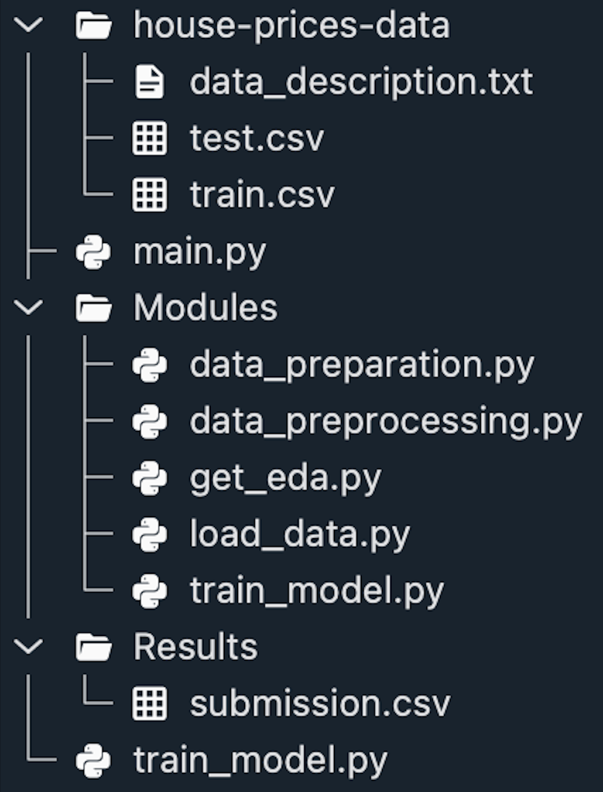

# House Prices - Advanced Regression Techniques

## Objective 

- Based on a dataset with 79 variables predict the sales price for each house. For each Id in the test set, predict the value of the SalePrice variable. 

## Data

- The data used in this project is from  [House Prices - Advanced Regression Techniques]
- This version of the dataset was downloaded from [Kaggle](https://www.kaggle.com/competitions/house-prices-advanced-regression-techniques/data)
- These are the tables that comprise the Open Dataset:

    + `train.csv`: the training set
    + `test.csv`:  the test set
    + `data_description.txt`:  full description of each column, originally prepared by Dean De Cock but lightly edited to match the column names used here
    + `sample_submission.csv`: a benchmark submission from a linear regression on year and month of sale, lot square footage, and number of bedrooms

## Steps

- `load_data.py`: Extract the training and test dataset from csv
- `get_eda.py`: Do an exploratory data analysis for the dataset
- `data_prearation.py`:  Fill null values, and drop columns 
- `data_preprocessing.py`: Encode categorical values and feature engineering
- `train_model.py`: Train the model, obtain score and model prediction 
  

## Repository structure

`house-prices-data`: File containing the data description txt, test csv, and  the train csv.
`Modules`: All the modules used for the script functionality 
`Results`: File cointaining the output of the model with the predicted prices. 

## Data Model
 
The data model for this project is explained in the following diagram.

Data dictionary: 

- `SalePrice ` - the property's sale price in dollars. This is the target variable that you're trying to predict.
- `MSSubClass: `The building class
- `MSZoning:` The general zoning classification
- `LotFrontage:` Linear feet of street connected to property
- `LotArea:`Lot size in square feet
- `Street:` Type of road access
- `Alley: `Type of alley access
- `LotShape:` General shape of property
- `LandContour: `Flatness of the property
- `Utilities: `Type of utilities available
- `LotConfig: `Lot configuration
- `LandSlope: `Slope of property
- `Neighborhood: `Physical locations within Ames city limits
- `Condition1: `Proximity to main road or railroad
- `Condition2: `Proximity to main road or railroad (if a second is present)
- `BldgType: `Type of dwelling
- `HouseStyle: `Style of dwelling
- `OverallQual:` Overall material and finish quality
- `OverallCond:` Overall condition rating
- `YearBuilt: `Original construction date
- `YearRemodAdd: `Remodel date
- `RoofStyle: `Type of roof
- `RoofMatl: `Roof material
- `Exterior1st: `Exterior covering on house
- `Exterior2nd: `Exterior covering on house (if more than one material)
- `MasVnrType:` Masonry veneer type
- `MasVnrArea: `Masonry veneer area in square feet
- `ExterQual: `Exterior material quality
- `ExterCond: `Present condition of the material on the exterior
- `Foundation: `Type of foundation
- `BsmtQual: `Height of the basement
- `BsmtCond: `General condition of the basement
- `BsmtExposure:` Walkout or garden level basement walls
- `BsmtFinType1:` Quality of basement finished area
- `BsmtFinSF1: `Type 1 finished square feet
- `BsmtFinType2: `Quality of second finished area (if present)
- `BsmtFinSF2: `Type 2 finished square feet
- `BsmtUnfSF:` Unfinished square feet of basement area
- `TotalBsmtSF: `Total square feet of basement area
- `Heating: `Type of heating
- `HeatingQC: `Heating quality and condition
- `CentralAir: `Central air conditioning
- `Electrical: `Electrical system
- `1stFlrSF: `First Floor square feet
- `2ndFlrSF: `Second floor square feet
- `LowQualFinSF: `Low quality finished square feet (all floors)
- `GrLivArea: `Above grade (ground) living area square feet
- `BsmtFullBath: `Basement full bathrooms
- `BsmtHalfBath: `Basement half bathrooms
- `FullBath: `Full bathrooms above grade
- `HalfBath: `Half baths above grade
- `Bedroom: `Number of bedrooms above basement level
- `Kitchen: `Number of kitchens
- `KitchenQual:` Kitchen quality
- `TotRmsAbvGrd:` Total rooms above grade (does not include bathrooms)
- `Functional:` Home functionality rating
- `Fireplaces: `Number of fireplaces
- `FireplaceQu:` Fireplace quality
- `GarageType:` Garage location
- `GarageYrBlt:` Year garage was built
- `GarageFinish:` Interior finish of the garage
- `GarageCars: `Size of garage in car capacity
- `GarageArea: `Size of garage in square feet
- `GarageQual:` Garage quality
- `GarageCond: `Garage condition
- `PavedDrive: `Paved driveway
- `WoodDeckSF: `Wood deck area in square feet
- `OpenPorchSF: `Open porch area in square feet
- `EnclosedPorch: `Enclosed porch area in square feet
- `3SsnPorch:` Three season porch area in square feet
- `ScreenPorch:` Screen porch area in square feet
- `PoolArea: `Pool area in square feet
- `PoolQC:` Pool quality
- `Fence: `Fence quality
- `MiscFeature: `Miscellaneous feature not covered in other categories
- `MiscVal: `$Value of miscellaneous feature
- `MoSold: `Month Sold
- `YrSold: `Year Sold
- `SaleType: `Type of sale
- `SaleCondition: `Condition of sale

## Technology used in current scenario

- `Python`: Python was used for all the modules.

## Production scenario

-  One time analysis / data modeling 
